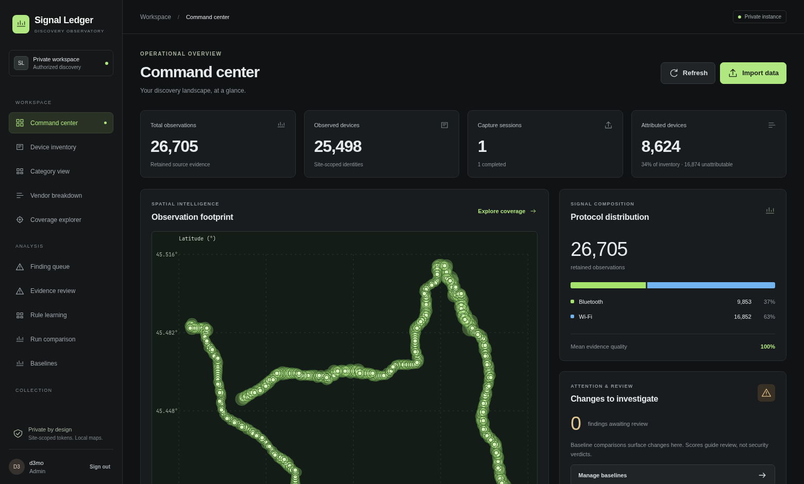
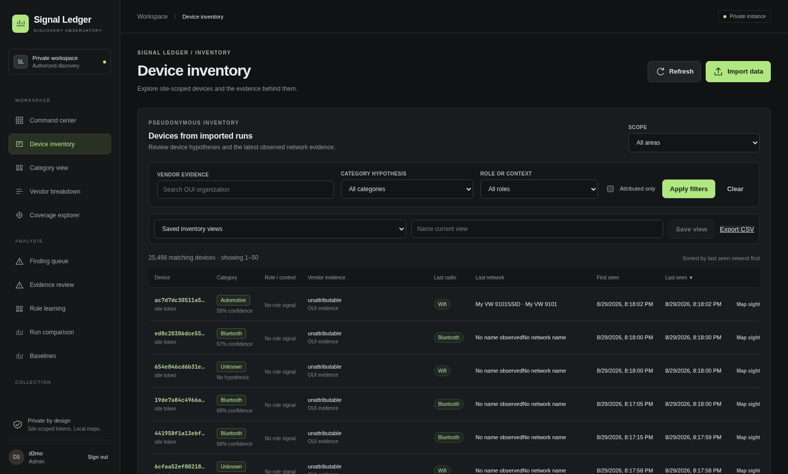
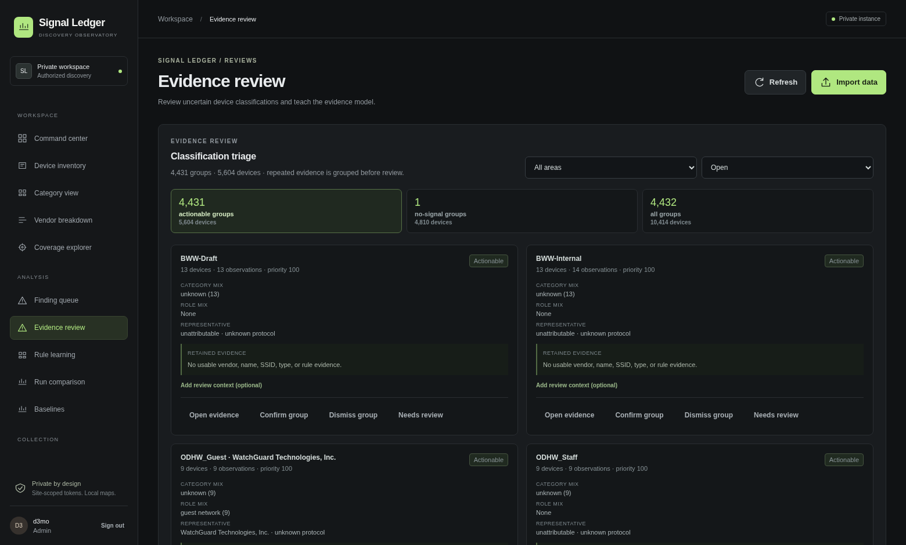
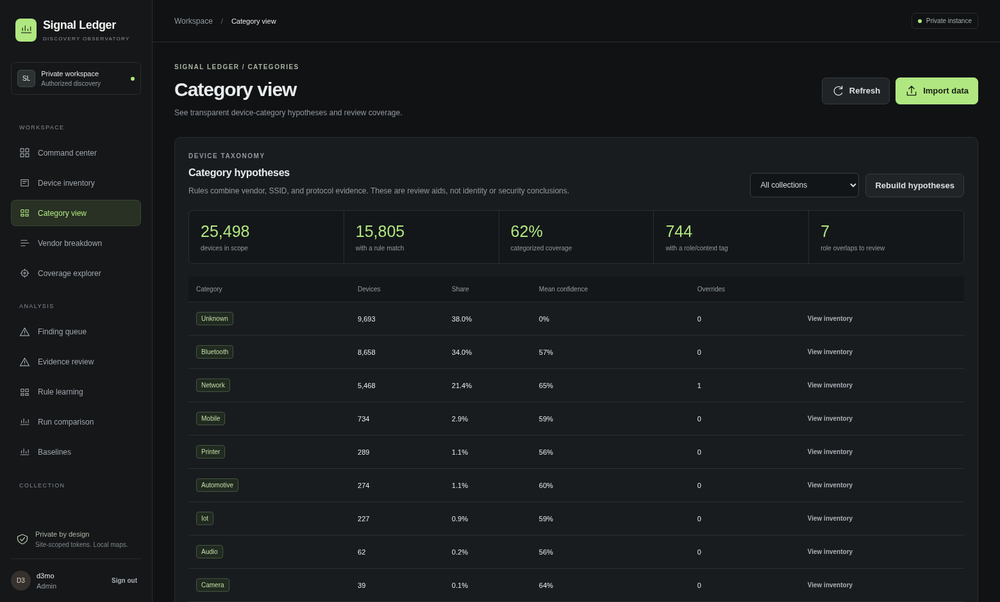
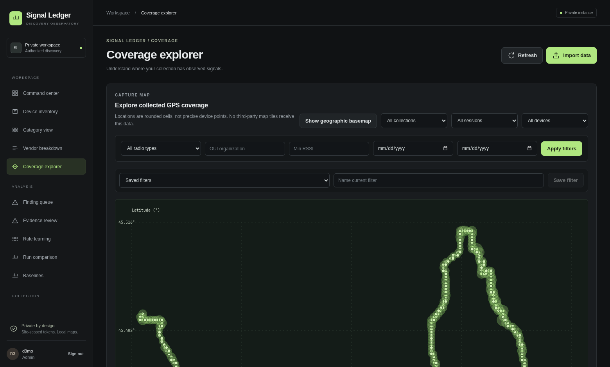

# Signal Ledger

Private, authorized-area discovery-log observatory. It ingests WiGLE CSV and Kismet CSV/NDJSON/native-summary exports, derives site-scoped device tokens, attributes only globally administered OUI prefixes, and provides an operator-facing inventory, coarse-cell coverage, evidence review, explainable categorization, and reviewable baseline findings.

## Screenshots

**Command center** — operational overview, observation footprint, and protocol composition at a glance.



**Device inventory** — pseudonymous, filterable device records with vendor evidence and category hypotheses.



**Evidence review** — grouped classification triage with retained evidence and audited dispositions.



**Category view** — transparent, rule-based category hypotheses with review coverage.



**Coverage explorer** — rounded-cell GPS coverage with no third-party map tiles involved.



## Run it

1. Copy .env.example to .env and replace every secret/password.
2. Run docker compose up --build.
3. Visit http://localhost:8000.

The stack intentionally uses three containers: app (FastAPI, static UI, and RQ worker under a supervisor), db (PostgreSQL/PostGIS), and redis (durable job queue). Raw uploads live on a named app volume; production encryption-at-rest should be supplied by the host volume or storage platform. On first use, create the initial administrator account in the UI. Passwords are Argon2-hashed and sessions are opaque HttpOnly cookies.

## Project records

- [Design brief](docs/DESIGN.md) — current decisions, boundaries, and system shape.
- [Delivery roadmap](docs/ROADMAP.md) — every phase, checked honestly against evidence.
- [Current-state guide](docs/CURRENT_STATE.md) — implemented surfaces, API contracts, and validation status.
- [Policy defaults](docs/POLICIES.md) — retention, precision, polygon, and review boundaries.
- [Deployment runbook](docs/DEPLOYMENT.md) — TLS, monitoring, upgrades, and rollback.
- [Build log](docs/BUILD_LOG.md) — append-only implementation and validation history.

## Current state

The UI supports first-run administrator creation, login, administrator-managed
roles, authorized collections and runs, asynchronous uploads, idempotent source
hashes, validation reports, audit events, pseudonymous inventory, coarse
spatial cells, local OUI enrichment, explainable category and role hypotheses,
baseline findings, and evidence review.

The inventory intelligence layer currently includes:

- Grouped and paginated evidence review with optional context, analyst
  dispositions, and audited category overrides.
- Category rules `rules-v6` and role rules `roles-v1`, with retained evidence
  and confidence scores.
- Analyst Learning for versioned rule proposals and false-positive measurement;
  accepting a proposal never silently changes production rules.
- Privacy-safe similarity fingerprints that return signal-family suggestions,
  not identity merges.
- Run Comparison for new, returning, changed, and disappeared devices.
- Saved inventory views and CSV exports containing pseudonymous tokens,
  classifications, roles, confidence, and provenance—never raw addresses.

The React application uses hash routes such as `/#inventory`, `/#reviews`,
`/#learning`, and `/#comparison`. Browser back/forward restores page routes;
device deep links use `/#device?id=123`.

## Schema and migrations

The project does not use Prisma or automatic ORM schema generation. It uses the
idempotent migration list in `app/migrations.py`. The app startup applies any
pending migrations before serving traffic, and the applied versions are stored
in `schema_migrations`. The current live rule-proposal migration is
`0013_rule_proposals`.

## Privacy boundary

Full MAC addresses are not stored in normalized tables. Device tokens are
site-scoped HMAC pseudonyms; locally administered/randomized addresses remain
unattributable. Exact addresses are retained only for policy-approved exact
collections, encrypted, and revealable only by an administrator with an audit
event. Fingerprints and exports remain bounded to non-address evidence.

New ingestion batches populate PostGIS geometry while the UI deliberately
presents only coarse cells.

## Validation status

The current implementation has **47 containerized tests** passing, a passing
frontend production build, live health verification, and migration `0013`
applied. Visual browser acceptance is still a separate open validation gate.

Run the suite with:

```bash
docker compose run --rm app pytest -q
```

## Operational defaults

The included defaults retain raw uploads for 30 days and normalized observations
for 365 days; administrators can change the persisted windows from the access
screen. The app
uses opaque HttpOnly sessions, Redis-backed request limits, security response
headers, and administrator session-revocation controls. Set `COOKIE_SECURE=true`
behind HTTPS.

This remains a private-tool foundation, not yet a production security
deployment. Restricted parser isolation and malware scanning, encrypted
external object storage, backup/restore and HMAC-rotation drills, load testing,
accessibility/browser validation, categorization threshold tuning, and
deployment monitoring remain open hardening work. See [the operations
runbook](docs/OPERATIONS.md) and [the roadmap](docs/ROADMAP.md) before using
retention, backup, restore, key rotation, or exports operationally.
